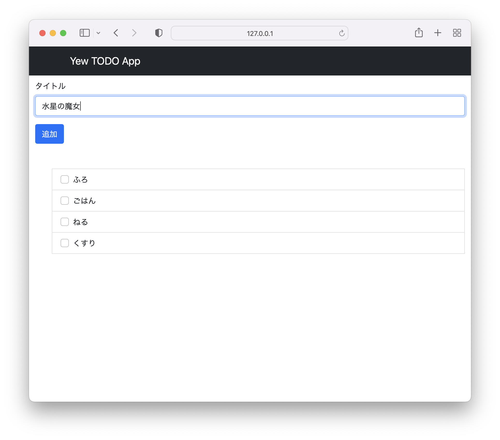

# yew-app

azukiazusaさんのYewのチュートリアルをやってみました。

[Web フロントエンドエンジニアのための Rust 製 Web フロントフレームワーク Yew 入門](https://zenn.dev/azukiazusa/articles/rust-base-web-front-fremework-yew)

## 元のコードからの修正点

フォームで日本語を入力すると途中で変換が確定されてしまってうまく入力できなかったので、以下の記事とコードを参考に、入力された文字のかわりにフォームの入力値を取得するように修正した

- [【Yew】Rustでフロントエンド開発 - Rustのマクロを紐解く - - ISID テックブログ](https://tech.isid.co.jp/entry/2022/10/11/%E3%80%90Yew%E3%80%91Rust%E3%81%A7%E3%83%95%E3%83%AD%E3%83%B3%E3%83%88%E3%82%A8%E3%83%B3%E3%83%89%E9%96%8B%E7%99%BA_-_Rust%E3%81%AE%E3%83%9E%E3%82%AF%E3%83%AD%E3%82%92%E7%B4%90%E8%A7%A3%E3%81%8F_-)
- [wasm-md-editor/Cargo.toml at main · ISID/wasm-md-editor](https://github.com/ISID/wasm-md-editor/blob/main/Cargo.toml)
